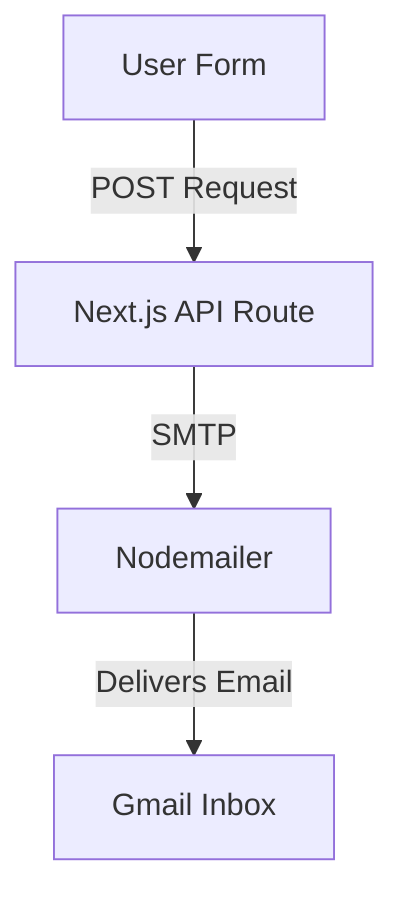

# Email Notification System Implementation Guide

## 1. System Overview
This project uses a secure, database-free architecture for handling form submissions. Instead of saving data to a database like Supabase, the system directly emails the submissions to a designated inbox.

The flow is as follows:
1. **User submits form**: The user fills out the contact form on the frontend.
2. **Next.js API Route receives data**: The client-side hook sends a POST request to `/api/inquiries`.
3. **Nodemailer sends email**: The server-side API securely connects to an SMTP server.
4. **Gmail receives notification**: An HTML-formatted email is delivered immediately to `buildxai.in@gmail.com`.
5. **No database storage**: No data is persisted on the server, ensuring privacy and eliminating database maintenance.

## 2. Architecture Diagram



## 3. Dependencies
To implement this system, the following packages are required:
* `nodemailer` (for sending emails)
* `@types/nodemailer` (for TypeScript support)
* Next.js App Router API Routes (built-in)

Installation:
```bash
npm install nodemailer
npm install -D @types/nodemailer
```

## 4. Environment Variables
Store these in your `.env.local` or production environment settings. Never commit these to version control.

```env
# Email Configuration
SMTP_EMAIL=your_email@gmail.com
SMTP_PASSWORD=your_16_digit_app_password
```

## 5. Gmail App Password Setup
If you are using a Gmail account, you cannot use your regular password. You must generate an App Password:
1. Go to your Google Account -> **Security**.
2. Enable **2-Step Verification** if it isn't already.
3. Search for **App passwords** (or find it under the 2-Step Verification menu).
4. Create a new app password (name it "Website Form").
5. Copy the 16-character password and paste it into `SMTP_PASSWORD` in your `.env.local` file.

## 6. Reusable API Route Template
Create a file at `src/app/api/contact/route.ts` (or similar) and use this template:

```typescript
import { NextResponse } from 'next/server';
import nodemailer from 'nodemailer';

export async function POST(req: Request) {
  try {
    const body = await req.json();
    const { name, phone, email, service, message, bot_field } = body;

    // Honeypot spam protection
    if (bot_field) return NextResponse.json({ success: true });

    // Validate variables
    if (!name || !phone) {
      return NextResponse.json({ success: false, error: 'Required fields missing' }, { status: 400 });
    }

    const { SMTP_EMAIL, SMTP_PASSWORD } = process.env;
    if (!SMTP_EMAIL || !SMTP_PASSWORD) {
      return NextResponse.json({ success: false, error: 'SMTP config missing' }, { status: 500 });
    }

    const transporter = nodemailer.createTransport({
      service: 'gmail',
      auth: { user: SMTP_EMAIL, pass: SMTP_PASSWORD },
    });

    const mailOptions = {
      from: \`"Website Form" <\${SMTP_EMAIL}>\`,
      to: 'your_destination_email@gmail.com',
      subject: \`New Lead: \${name}\`,
      text: \`Name: \${name}\\nPhone: \${phone}\\nEmail: \${email}\\nService: \${service}\\nMessage: \${message}\`,
      html: \`
        <h3>New Inquiry Received</h3>
        <p><strong>Name:</strong> \${name}</p>
        <p><strong>Phone:</strong> \${phone}</p>
        <p><strong>Email:</strong> \${email}</p>
        <p><strong>Service:</strong> \${service}</p>
        <p><strong>Message:</strong> \${message}</p>
      \`,
    };

    await transporter.sendMail(mailOptions);
    return NextResponse.json({ success: true });
  } catch (error) {
    return NextResponse.json({ success: false, error: 'Failed to send email' }, { status: 500 });
  }
}
```

## 7. Reusable Form Submit Template
Client-side implementation example (React/Next.js):

```tsx
"use client";
import { useState } from "react";

export function ContactForm() {
  const [status, setStatus] = useState<"idle" | "loading" | "success" | "error">("idle");

  const handleSubmit = async (e: React.FormEvent<HTMLFormElement>) => {
    e.preventDefault();
    setStatus("loading");
    
    const formData = new FormData(e.currentTarget);
    const data = Object.fromEntries(formData.entries());

    try {
      const res = await fetch('/api/contact', {
        method: 'POST',
        headers: { 'Content-Type': 'application/json' },
        body: JSON.stringify(data),
      });
      
      if (!res.ok) throw new Error("Submission failed");
      setStatus("success");
    } catch (err) {
      setStatus("error");
    }
  };

  if (status === "success") return <p>Thank you for reaching out!</p>;

  return (
    <form onSubmit={handleSubmit}>
      {/* Honeypot field - hide via CSS */}
      <input type="text" name="bot_field" style={{ display: 'none' }} />
      
      <input type="text" name="name" required placeholder="Name" />
      <input type="tel" name="phone" required placeholder="Phone" />
      <input type="email" name="email" placeholder="Email (optional)" />
      <textarea name="message" placeholder="Message"></textarea>
      
      <button type="submit" disabled={status === "loading"}>Submit</button>
      {status === "error" && <p>Error submitting form. Try again.</p>}
    </form>
  );
}
```

## 8. Validation Rules
The system enforces backend and frontend validation to ensure clean data:
* **Name**: Required. Checked for valid characters (letters only).
* **Phone**: Required. Must be a valid 10-digit number.
* **Email**: Optional. If provided, verified against standard email regex formats.
* **Service**: Required selection from dropdown.
* **Honeypot**: A visually hidden input field (`bot_field`) that actual users won't see. If filled (by a bot scraping the DOM), the server silently rejects the email but returns a success code.

## 9. Error Handling
* **Client-Side**: Displays specific errors underneath respective inputs if validation fails before submission. Displays a global alert if the server connection drops.
* **Server-Side**: Catches SMTP failure errors and securely logs them on the server side without exposing credentials to the client. Returns generic HTTP 500 errors to prevent leaking stack traces.

## 10. Production Deployment Checklist
- [ ] Ensure `nodemailer` is installed in `package.json`.
- [ ] Ensure the Honeypot field is present in the form and hidden via CSS/Tailwind.
- [ ] Create an App Password in Gmail.
- [ ] Add `SMTP_EMAIL` and `SMTP_PASSWORD` to the Vercel/Netlify Environment Variables panel.
- [ ] Test the form in the live production environment.
- [ ] Verify you receive the email and it doesn't land in the Spam folder.

## 11. How to Reuse in Future Projects
Because this system is entirely self-contained (only requires `nodemailer` and an API route), it can be copy-pasted into any Next.js App Router project within 10 minutes. 

**Examples of reuse:**
* **School Website**: Change fields to "Student Name, Parent Email, Grade".
* **Hospital Website**: Change fields to "Patient Name, Appointment Date, Doctor".
* **Portfolio Website**: Keep it minimal with "Name, Email, Message".
* **Agency Website**: Add fields for "Budget" and "Timeline".
* **SaaS Landing Page**: Use for early access waitlists (collect only "Email").

## 12. Common Errors and Fixes
* **SMTP Authentication Failed**: 
  * Cause: Wrong password or standard password used instead of App Password.
  * Fix: Generate a new App Password in Google Security settings.
* **Missing Env Variables**: 
  * Cause: Variables not loaded into the deployment environment.
  * Fix: Add them to Vercel dashboard and trigger a redeploy.
* **Gmail Blocking Sign-in**: 
  * Cause: Gmail suspects unusual activity.
  * Fix: Go to Google account and review security alerts to mark the login as "It was me".
* **Build Errors (TypeScript)**: 
  * Cause: `req.json()` typing issues or missing `@types/nodemailer`.
  * Fix: Ensure types are installed and `any` catches are explicitly typed.

## 13. Copy-Paste Starter Template
You can simply copy the two files provided in Sections 6 and 7 into a new project, configure your `.env.local`, and you will have a working email system instantly. No database migrations, SQL, or dashboard setups required.
